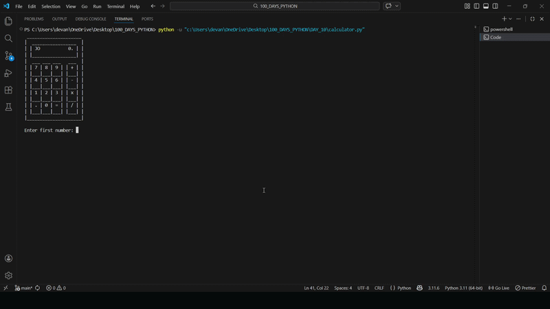

# 🧮 Python Calculator – CLI Based Arithmetic System

A simple Python-based calculator program that performs basic arithmetic operations and allows continuous calculations using the previous result.

This project simulates a real-world calculator in the terminal where users can chain operations, restart calculations, or exit anytime.

---

## 🚀 Demo

---

## 🛠 Features

* Performs Addition, Subtraction, Multiplication, and Division

* Uses separate functions for each operation

* Stores operations inside a dictionary for dynamic execution

* Allows continuation with previous result

* Option to start a new calculation

* Exit option to terminate program

* Clears the screen when starting a new calculation

* Interactive calculation loop

---

## 📚 Concepts Used

* Functions

* Dictionaries (storing function references)

* While loops

* Conditional statements

* User input handling

* Type casting (float())

* Dynamic function calling using dictionary keys

* Using os.system() to clear console

---