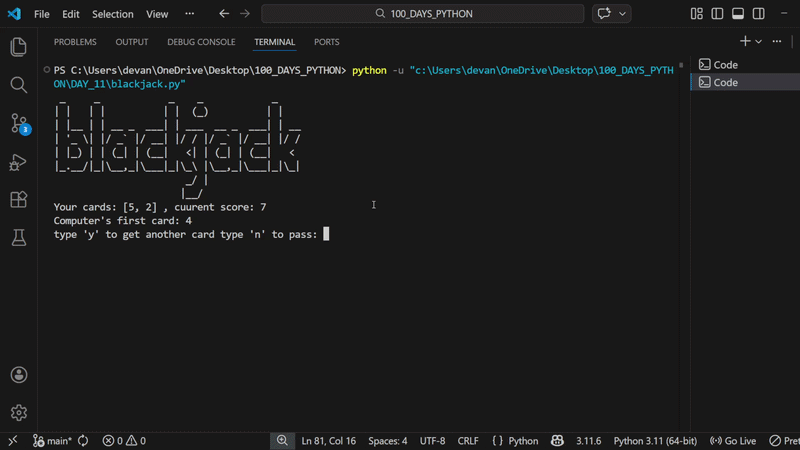

# 🃏 Python Blackjack – CLI Based Card Game

A simple Python-based Blackjack game that runs in the terminal and simulates the classic casino card game.

This project allows the user to play against a computer dealer, draw cards, calculate scores automatically, and determine the winner following Blackjack rules.

---

## 🚀 Demo

---

## 🛠 Features

* Simulates a Blackjack card game in the terminal

* Random card dealing using Python's random module

* Automatic score calculation including Ace adjustment (11 → 1)

* Detects Blackjack automatically

* Computer dealer follows Blackjack rule (draw until score ≥ 17)

* Displays user's cards and dealer's first card during gameplay

* Determines winner based on Blackjack rules

* Option to play multiple rounds

* Clears the screen when restarting the game

* Interactive gameplay loop

---

## 📚 Concepts Used

* Functions

* Lists (storing cards)

* Random module

* While loops

* Conditional statements

* Game state management

* Function decomposition

* Recursion for restarting the game

* User input handling

* Using os.system() to clear console

---