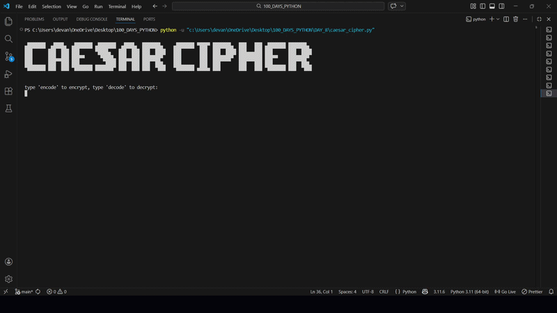

# 🔐 Caesar Cipher – Python Encryption Tool

A simple Python-based encryption and decryption program using the classic Caesar Cipher technique.

This project allows users to encode and decode messages by shifting letters of the alphabet by a given number.

---

## 🚀 Demo




---

## 🛠 Features

* Encode messages (encryption)
* Decode messages (decryption)
* Preserves spaces and special characters
* Handles large shift values using modulo logic
* Interactive loop for multiple operations

---


## 🧠 How It Works

The Caesar Cipher shifts each letter in the message by a fixed number (shift value).

Example:

```
Message: hello
Shift: 3
Output: khoor
```

Decryption reverses the shift.

---

## 📚 Concepts Used

* Functions
* Loops
* Conditionals
* Lists
* String manipulation
* Modulo operator
* While loop for continuous execution

---

## 💡 What I Learned

* How basic encryption works
* Writing reusable functions
* Handling user input
* Building interactive terminal applications

---


