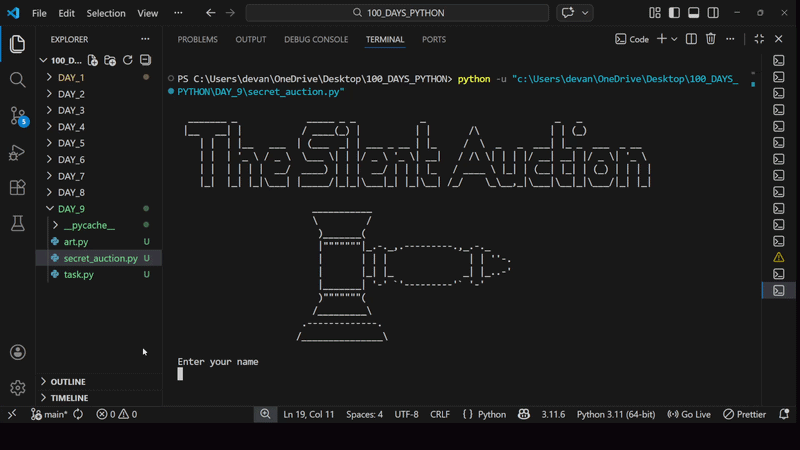

# 🏆 Blind Auction – Python Bidding System

A simple Python-based blind auction program that collects bids from multiple participants and determines the highest bidder.

This project simulates a real-world blind auction where participants cannot see each other's bids.

---

## 🚀 Demo

---

## 🛠 Features

* Collects multiple bids from users
* Stores bids securely using a dictionary
* Clears the screen between entries
* Determines the highest bidder
* Displays the winner with the maximum bid amount
* Interactive bidding loop

---

## 📚 Concepts Used

* Dictionaries (key-value pairs)
* While loops
* For loops
* Conditional statements
* User input handling
* Type casting (`int()`)
* Basic algorithm for finding maximum value
* Using `os.system()` to clear console

---